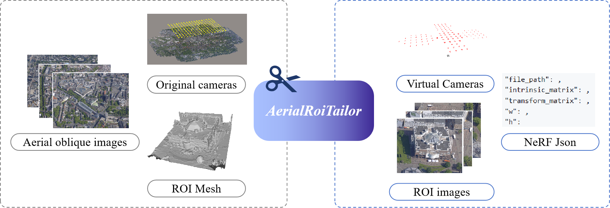
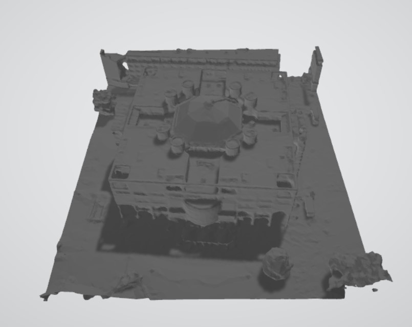
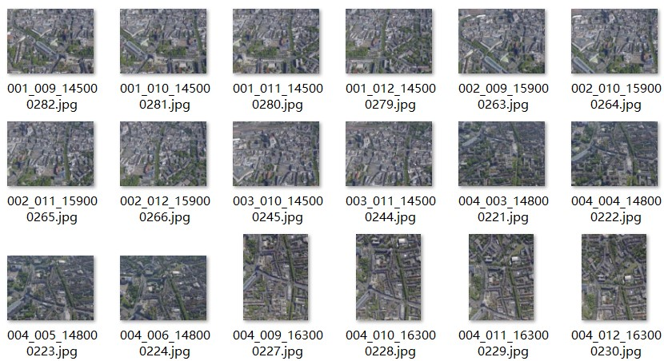

# AerialRoiTailor
## Overview
<p align="center"></p>
Select regions of interest (ROI) from large aerial oblique image datasets, and generate corresponding ROI datasets and virtual camera parameters for regional scene modeling. The output is compatible with input requirements for NeRF, Instant-NGP, 3DGS.

## Theory
### 1. Visibility Filtering

The visibility of world points in the region of interest (ROI) is determined by comparing the angle $\beta$ between the camera orientation $c_o$ and the line from the camera center $c$ to the vertex $p$ of Mesh, against the camera’s field of view (FoV).  

<p align="center">
    $$\beta = \frac{c_p \cdot c_o}{|c_p| \cdot |c_o|}$$  
</p>

<p align="center">
	$$fov = \arctan\left(\frac{sensor\_size}{2 \cdot focal}\right)$$   
</p>

<p align="center"> 
	$$if \ \beta < \frac{fov}{2} \Rightarrow visible$$  
</p>

*If the ratio of the number of visible points on the image to the total number of vertices in the region of interest mesh exceeds the threshold (default set to 0.05) ,  the image is considered valid and selected for further processing.*

### 2. Bounding Box-Based Cropping

After visibility filtering, to focus on the ROI and reduce distractions from irrelevant areas, the visible portion’s bounding box is computed based on the camera’s external (w2c) and internal (c2p) parameters, and the image is cropped accordingly.

*Scaling and cropping operations will alter the camera's intrinsic parameters. Scaling affects the principal point and focal length, while cropping only affects the principal point. The strategy below ensures the cropped image retains the same dimensions.*

<p align="center"></p>

### 3. Generate Camera Parameter File

The input data format is inspired by NeRF Studio and Instant-NGP, supporting multi-camera setups.

```
{
  "camera_mode": ,
  "camera_orientation": ,
  "aabb_scale": ,
  "aabb_range":,
  "sphere_center":,
  "sphere_radius":,
  "frames": [
    {
      "file_path": ,
      "intrinsic_matrix": ,
      "transform_matrix": ,
      "w": ,
      "h": 
    }, 
    ...
  ]
}
```

## Usage

### 0. Environment Setup

```
conda env create -f environment.yaml
```

### 1. Dataset Creation with Context Capture Center


1. Download a large-scale aerial oblique imagery dataset. Example: EuroSDR Benchmark for Multi-Platform Photogrammetry, published by ISPRS.  
   [Link](https://www2.isprs.org/commissions/comm2/icwg-2-1a/benchmark_main/)
2. In Context Capture Master, create a new project, load the dataset, and run the photogrammetric processing.
3. Export the camera parameters (AT.xml) and undistorted images. 
   * When exporting the camera parameters after photogrammetric processing, select the axis orientation as `opencv` format (i.e., `xyz-RDF`). 
   * In the exported camera parameters, the rotation matrix is the w2c matrix, and the camera center corresponds to the camera's position in the world coordinate system.
4. Create a reconstruction project, select the region of interest, and generate the mesh file (Model.obj) and metadata file (metadata.xml).

### 2. Organize Data in the Correct Format

Create a `dataset` folder in the project directory and organize the data as follows:

```
dataset
|_ dataset_01
   |_ images        // Store visible images (empty)
   |_ images_crop   // Store cropped visible images based on ROI (empty)
   |_ AT.xml        // Camera parameter file from photogrammetry
   |_ metadata.xml  // Metadata for the region of interest
   |_ Model.obj     // Mesh file for the region of interest
```

### 3. Configuration

Set the parameters in `config.py`:

* `dataset_dir`: Root of dataset.

* ` if_mask_crop`:Crop images based on the bounding box or not. If true, cropped images will be output, otherwise the original images containing the ROI will be used.
*  `tar_size_w`, `tar_size_h`: Set unified image dimensions after cropping.

* `if_standardization`: Standardize the scene or not . If true, the entire scene will be translated and scaled——the coordinate origin is moved to the mesh’s geometric center, and the scene is scaled within a target sphere.
* `tar_radius`: Target sphere radius.

### 4. Run

* After dataset creation and parameter configuration, run `run.py`.  
* To visualize the processed scene, run `scene_viser.py`.

### 5. Expected Output

```
dataset
|_ dataset_01
   |_ images        // Store visible images
   |_ images_crop   // Store cropped visible images based on ROI
   |_ AT.xml        // Camera parameter file
   |_ metadata.xml  // Metadata for the region of interest
   |_ Model.obj     // Mesh file for the region of interest
   |_ transforms.json   // Camera parameter file
   |_ Model_resized.obj  // Standardized mesh file
```

## Testing

* Dataset:  
  ISPRS Penta-Cam-Centre (8bit)

* Parameter Settings:  
  `if_mask_crop`=True, `if_standardization`=True, `tar_size_w`=1200, `tar_size_h`=1000, `tar_radius`=1.0

* ROI mesh exported from CC 3D reconstruction:
<p align="center"></p>
* Selected images containing the region of interest (8176 * 6132):
<p align="center"></p>
* Cropped ROI from the image using the bounding box, with new image dimensions (1200 * 1000):
<p align="center"></p>
* Camera parameters for the new image:

```
{
  "camera_mode": "Perspective",
  "camera_orientation": "XRightYDown",
  "aabb_scale": 1.0,
  "aabb_range": [
    [-0.6599620197815109, 0.6599620197815114],
    [-0.7196484545274785, 0.719648454527478],
    [-0.21576893738933003, 0.21576893738932795]
  ],
  "sphere_center": [0, 0, 0],
  "sphere_radius": 1.0,
  "frames": [
    {
      "file_path": "images/001_009_145000282.jpg",
      "intrinsic_matrix": [
        [13658.7021484375, 0.0, -2580.524169921875],
        [0.0, 13658.7021484375, 323.05224609375],
        [0.0, 0.0, 1.0]
      ],
      "transform_matrix": [
        [0.9999997615814209,0.00018038207781501114,-0.0006661160150542855,-3.903818368911743],
        [0.0006009129574522376,-0.7022261023521423,0.7119537591934204,-11.74245548248291],
        [-0.0003393403603695333,-0.7119539976119995,-0.7022260427474976,11.748698234558105],
        [0.0, 0.0, 0.0, 1.0]
      ],
      "w": 1200,
      "h": 1000
    },
    ...
}
```


* Visualize the processed scene: red indicates the camera frustum, and blue indicates the scene bounding sphere.  

 <p align="center"></p>

## To Do

- [x] Support automatic detection of single/multi-camera setups
- [x] Support scene visualization
- [x] Optimize code structure
- [ ] Support handling distorted images without using CC export


## Acknowledgments

Special thanks to the following projects:

* Dataset: [Link](https://www2.isprs.org/commissions/comm2/icwg-2-1a/benchmark_main/)
* Camera Visualization: [NeRF++](https://github.com/Kai-46/nerfplusplus)
* JSON Format: [nerfstudio](https://github.com/nerfstudio-project/nerfstudio), [Neuralangelo](https://github.com/NVlabs/neuralangelo)
